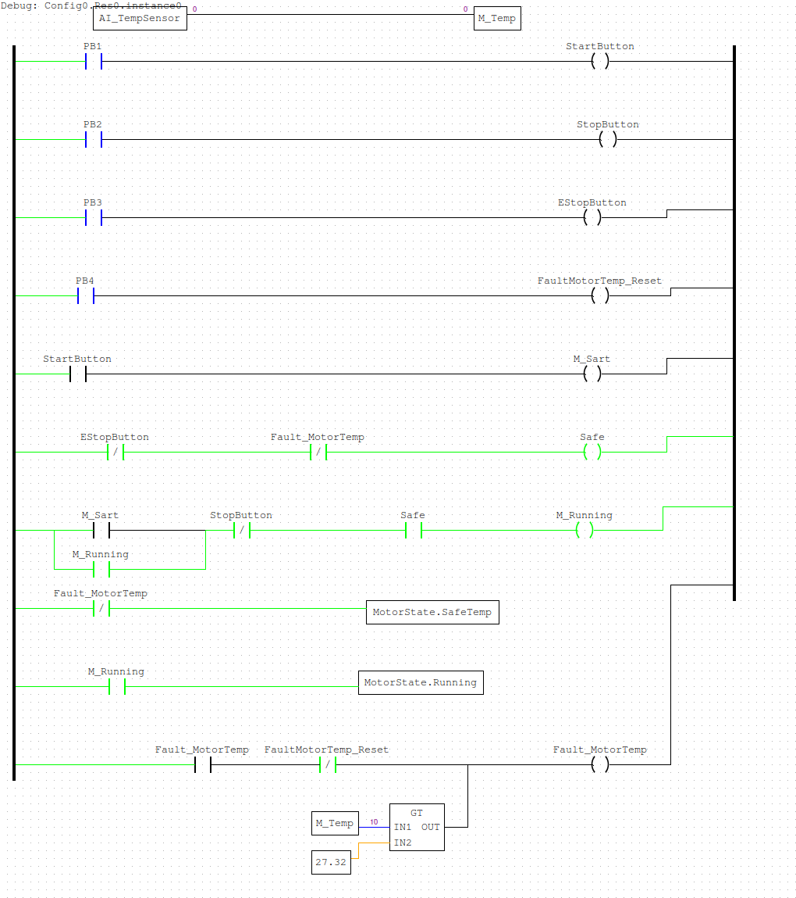
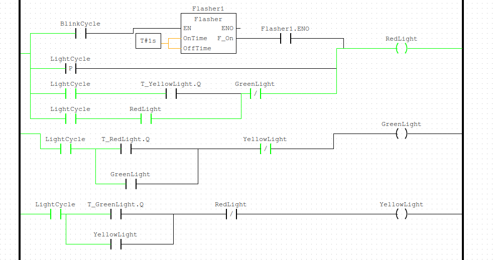

# PLC_LD_Projects
Practice Projects for Ladder Logic

## Motor

In function this is a simple motor control program. It mixes the Input Mapping, Start/Stop, and 5 Rung patterns. Map global inputs into local logic. Create a safe state based on the emergency stop and an overheating fault. Use a start stop pattern on the motor and output the state to a global struct of the motor state. 

This seems like a big program for just a motor. I could simplify it by moving my input mappings to their own program, but I'm not sure if that makes it more confusing. I will probably update the two stopping buttons to work as if they were wired NC instead of NO.

## Traffic Light
This project includes a timed sequential light cycle for a red, green, yellow traffic light. It has a start and stop function. When stopped the red light flashes. There is also a cross walk function. The main goal of this project was to work on making larger project more modular. I Created structs for the main programs so that there can be shared global states. An example of this need would be for the crosswalk module to know when the traffic light module transitioned into the red light state so the walk light sequence can begin. There are also fault sensors to turn the system off if a light fails.

